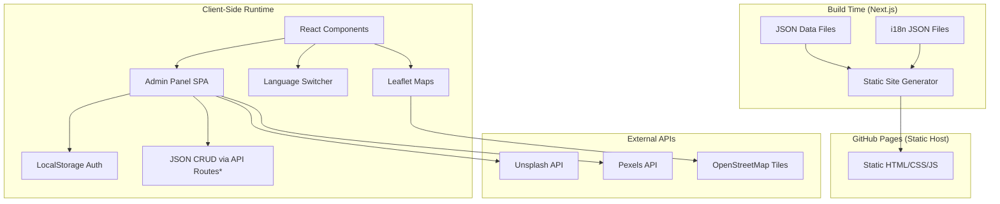
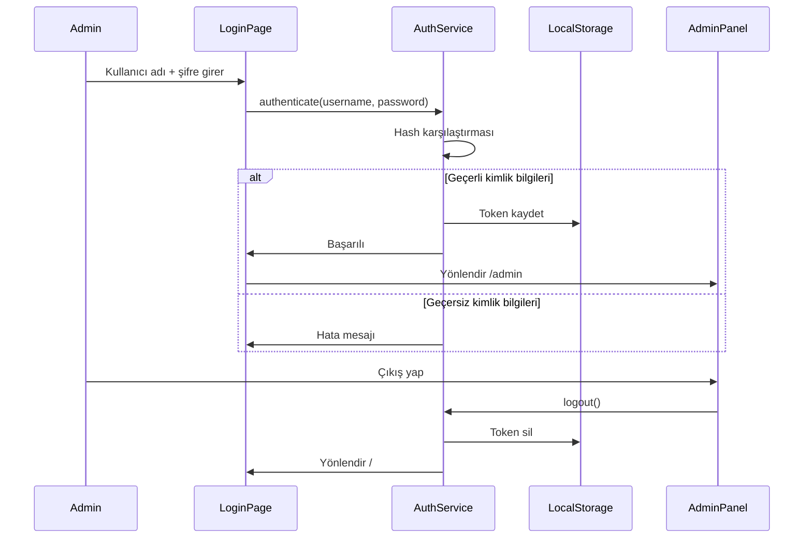

# Design Document: Travel Atlas

## Overview

Travel Atlas, Next.js App Router kullanılarak statik olarak dışa aktarılan (Static Export), GitHub Pages üzerinde barındırılan çok dilli bir seyahat öneri platformudur. Uygulama React bileşenleri, Tailwind CSS ile koyu tema tasarım sistemi, JSON tabanlı içerik yönetimi ve Leaflet harita entegrasyonu kullanır. Admin paneli client-side authentication ile korunur ve içerik CRUD işlemleri JSON dosyaları üzerinden gerçekleştirilir.

### Temel Teknoloji Kararları

| Karar | Seçim | Gerekçe |
|-------|-------|---------|
| Framework | Next.js 14 (App Router, Static Export) | `output: 'export'` ile GitHub Pages uyumlu statik çıktı |
| Styling | Tailwind CSS 3 | Utility-first, dark theme desteği, glassmorphism kolaylığı |
| Dil | TypeScript | Tip güvenliği, Content_Item veri modeli doğrulaması |
| Harita | Leaflet + react-leaflet | Ücretsiz, OpenStreetMap tile desteği |
| i18n | next-intl veya custom JSON i18n | Statik export uyumlu, route-based dil desteği |
| Görsel API | Unsplash API + Pexels API | Ücretsiz stok fotoğraf erişimi |
| Font | Inter (Google Fonts) | Modern, okunabilir, değişken ağırlık desteği |
| Test | Vitest + fast-check | Property-based testing için |

## Architecture

### Üst Düzey Mimari



*Not: GitHub Pages statik hosting olduğundan, admin paneli client-side çalışır. Gerçek CRUD işlemleri için ileride Supabase/Firebase entegrasyonu planlanmıştır. İlk aşamada JSON dosyaları manuel olarak güncellenir veya local development server üzerinden düzenlenir.*

### Sayfa Yapısı ve Routing

```
/                            → Ana Sayfa (Hero, Explore, Öneriler, Popüler, Yeni, Harita, Arkadaş Deneyimleri, Blog, Footer)
/explore                     → Tüm destinasyonlar listesi
/my-recommendations          → Admin'in kişisel önerileri
/friend-experiences          → Arkadaş deneyimleri listesi
/friend-experiences/[slug]   → Arkadaş deneyimi detay sayfası
/location/[slug]             → Lokasyon detay sayfası
/blog                        → Blog yazıları listesi
/blog/[slug]                 → Blog yazısı detay sayfası
/admin                       → Admin dashboard (korumalı)
/login                       → Admin giriş sayfası
```

### Dil Yönlendirme Stratejisi

Statik export kısıtlaması nedeniyle middleware kullanılamaz. Dil yönetimi client-side olarak yapılır:

1. Varsayılan dil: Türkçe (tr)
2. Dil tercihi `localStorage` üzerinde saklanır
3. URL'de dil parametresi kullanılmaz (tek route seti)
4. Tüm UI metinleri JSON i18n dosyalarından dinamik olarak yüklenir
5. İçerik çevirileri Content_Item JSON yapısında `tr` ve `en` alanları olarak saklanır

## Components and Interfaces

### Bileşen Hiyerarşisi

```mermaid
graph TD
    A[RootLayout] --> B[Navbar]
    A --> C[Footer]
    A --> D[LanguageProvider]

    D --> E[HomePage]
    E --> E1[HeroSection]
    E --> E2[ExploreSection]
    E --> E3[MyRecommendations]
    E --> E4[PopularRoutes]
    E --> E5[NewlyAdded]
    E --> E6[DiscoverOnMap]
    E --> E7[BlogPostsSection]
    E --> E8[FriendExperiencesSection]

    D --> F[ExplorePage]
    D --> G[LocationDetailPage]
    G --> G1[CoverImage]
    G --> G2[InfoSections]
    G --> G3[DailyRoutePlan]
    G --> G4[BudgetSection]
    G --> G5[RouteMap]
    G --> G6[PhotoGallery]
    G --> G7[CommentsSection]

    D --> H[BlogPage]
    D --> I[BlogDetailPage]

    D --> N[FriendExperiencesPage]
    D --> O[FriendExperienceDetailPage]
    O --> O1[FriendPhotos]
    O --> O2[FriendNarrative]
    O --> O3[VisitedLocationLinks]

    D --> J[AdminLayout]
    J --> J1[AdminDashboard]
    J --> J2[ContentEditor]
    J --> J3[ImageManager]
    J --> J4[MapCoordinatePicker]
    J --> J5[RoutePointEditor]
    J --> J6[FriendExperienceEditor]

    D --> K[LoginPage]
```



### Temel Arayüzler (TypeScript)

```typescript
// Content_Item temel arayüzü
interface ContentItem {
  id: string;
  slug: string;
  type: 'location' | 'blog' | 'recommendation' | 'friend-experience';
  status: 'draft' | 'published' | 'unpublished';
  createdAt: string; // ISO 8601
  updatedAt: string; // ISO 8601
  coverImage: string; // görsel yolu
  seo: {
    tr: { title: string; description: string };
    en: { title: string; description: string };
  };
  content: {
    tr: ContentBody;
    en: ContentBody;
  };
}

// Lokasyon içerik gövdesi
interface LocationContent extends ContentBody {
  city: string;
  country: string;
  introduction: string;
  transportation: string;
  accommodation: string;
  museums: string;
  historicalPlaces: string;
  restaurants: string;
  dailyRoutePlan: RoutePlanDay[];
  estimatedBudget: BudgetItem[];
  coordinates: { lat: number; lng: number };
  gallery: string[]; // görsel yolları
}

// Blog içerik gövdesi
interface BlogContent extends ContentBody {
  title: string;
  body: string; // Markdown
  tags: string[];
}

// Genel içerik gövdesi
interface ContentBody {
  title: string;
  summary: string;
}

// Günlük rota planı
interface RoutePlanDay {
  day: number;
  title: string;
  activities: string[];
  routePoints: RoutePoint[]; // harita üzerindeki rota noktaları
}

// Rota noktası (harita marker + bilgi)
interface RoutePoint {
  name: string;
  coordinates: { lat: number; lng: number };
  description: string;
  tips: string;
  order: number; // ziyaret sırası
}

// Bütçe kalemi
interface BudgetItem {
  category: string;
  amount: number;
  currency: string;
  note: string;
}

// Arkadaş deneyimi içerik gövdesi
interface FriendExperienceContent extends ContentBody {
  friendName: string;
  visitedLocations: { name: string; slug?: string }[]; // slug varsa Location_Page'e link
  narrative: string; // kişisel anlatım (Markdown)
  locationComments: { locationName: string; comment: string }[];
  gallery: string[]; // arkadaşın kendi fotoğrafları
}

// i18n çeviri yapısı
interface Translations {
  [key: string]: string | Translations;
}

// Admin kimlik doğrulama
interface AuthState {
  isAuthenticated: boolean;
  username: string | null;
  token: string | null;
}

// Harita marker verisi
interface MapMarker {
  slug: string;
  title: string;
  coordinates: { lat: number; lng: number };
  coverImage: string;
  color?: 'red' | 'blue' | 'default'; // kırmızı rota marker'ları
  description?: string; // popup'ta gösterilecek kısa bilgi
  tips?: string; // popup'ta gösterilecek önemli bilgiler
}

// Harita rota çizgisi
interface MapRoute {
  points: { lat: number; lng: number }[]; // sıralı koordinatlar
  color: string; // çizgi rengi
  label?: string; // rota adı
}
```

### Temel Bileşen Arayüzleri

```typescript
// LanguageProvider
interface LanguageContextValue {
  locale: 'tr' | 'en';
  setLocale: (locale: 'tr' | 'en') => void;
  t: (key: string) => string;
}

// ContentCard (genel kart bileşeni)
interface ContentCardProps {
  item: ContentItem;
  locale: 'tr' | 'en';
  variant?: 'default' | 'featured' | 'compact';
}

// ImageManager (admin)
interface ImageManagerProps {
  onImageSelect: (imagePath: string) => void;
  currentImage?: string;
}

// MapCoordinatePicker (admin)
interface MapCoordinatePickerProps {
  initialCoordinates?: { lat: number; lng: number };
  onCoordinateChange: (coords: { lat: number; lng: number }) => void;
}

// RoutePointEditor (admin - rota noktası düzenleme)
interface RoutePointEditorProps {
  routePoints: RoutePoint[];
  onRoutePointsChange: (points: RoutePoint[]) => void;
}

// RouteMap (lokasyon detay - rota haritası)
interface RouteMapProps {
  center: { lat: number; lng: number };
  routePoints: RoutePoint[];
  zoom?: number;
}

// FriendExperienceEditor (admin)
interface FriendExperienceEditorProps {
  experience?: ContentItem; // düzenleme modunda mevcut veri
  onSave: (data: ContentItem) => void;
}
```

## Data Models

### JSON Veri Dosya Yapısı

```
/data
  /locations
    istanbul.json
    paris.json
    ...
  /blog
    first-post.json
    ...
  /recommendations
    my-top-picks.json
    ...
  /friend-experiences
    ali-istanbul.json
    ...
  /i18n
    tr.json
    en.json
```

### Örnek Location JSON

```json
{
  "id": "loc-001",
  "slug": "istanbul",
  "type": "location",
  "status": "published",
  "createdAt": "2024-01-15T10:00:00Z",
  "updatedAt": "2024-01-20T14:30:00Z",
  "coverImage": "/images/locations/istanbul-cover.jpg",
  "seo": {
    "tr": {
      "title": "İstanbul Seyahat Rehberi",
      "description": "İstanbul'da gezilecek yerler, ulaşım ve konaklama önerileri"
    },
    "en": {
      "title": "Istanbul Travel Guide",
      "description": "Places to visit, transportation and accommodation tips in Istanbul"
    }
  },
  "content": {
    "tr": {
      "title": "İstanbul",
      "summary": "Doğu ile Batı'nın buluştuğu eşsiz şehir",
      "city": "İstanbul",
      "country": "Türkiye",
      "introduction": "...",
      "transportation": "...",
      "accommodation": "...",
      "museums": "...",
      "historicalPlaces": "...",
      "restaurants": "...",
      "dailyRoutePlan": [
        { "day": 1, "title": "Tarihi Yarımada", "activities": ["Ayasofya", "Sultanahmet", "Topkapı"], "routePoints": [
          { "name": "Ayasofya", "coordinates": { "lat": 41.0086, "lng": 28.9802 }, "description": "Bizans döneminden kalma muhteşem bazilika", "tips": "Sabah erken gidin, kalabalık olur", "order": 1 },
          { "name": "Sultanahmet Camii", "coordinates": { "lat": 41.0054, "lng": 28.9768 }, "description": "Mavi Cami olarak da bilinir", "tips": "Namaz saatlerinde kapalıdır", "order": 2 },
          { "name": "Topkapı Sarayı", "coordinates": { "lat": 41.0115, "lng": 28.9833 }, "description": "Osmanlı padişahlarının yaşadığı saray", "tips": "Harem bölümü ayrı bilet", "order": 3 }
        ]}
      ],
      "estimatedBudget": [
        { "category": "Konaklama", "amount": 500, "currency": "TRY", "note": "Orta segment otel" }
      ],
      "coordinates": { "lat": 41.0082, "lng": 28.9784 },
      "gallery": ["/images/locations/istanbul-1.jpg", "/images/locations/istanbul-2.jpg"]
    },
    "en": {
      "title": "Istanbul",
      "summary": "The unique city where East meets West",
      "city": "Istanbul",
      "country": "Turkey",
      "introduction": "...",
      "transportation": "...",
      "accommodation": "...",
      "museums": "...",
      "historicalPlaces": "...",
      "restaurants": "...",
      "dailyRoutePlan": [
        { "day": 1, "title": "Historical Peninsula", "activities": ["Hagia Sophia", "Blue Mosque", "Topkapi Palace"], "routePoints": [
          { "name": "Hagia Sophia", "coordinates": { "lat": 41.0086, "lng": 28.9802 }, "description": "Magnificent basilica from the Byzantine era", "tips": "Go early in the morning to avoid crowds", "order": 1 },
          { "name": "Blue Mosque", "coordinates": { "lat": 41.0054, "lng": 28.9768 }, "description": "Also known as Sultan Ahmed Mosque", "tips": "Closed during prayer times", "order": 2 },
          { "name": "Topkapi Palace", "coordinates": { "lat": 41.0115, "lng": 28.9833 }, "description": "Palace of Ottoman sultans", "tips": "Harem section requires separate ticket", "order": 3 }
        ]}
      ],
      "estimatedBudget": [
        { "category": "Accommodation", "amount": 500, "currency": "TRY", "note": "Mid-range hotel" }
      ],
      "coordinates": { "lat": 41.0082, "lng": 28.9784 },
      "gallery": ["/images/locations/istanbul-1.jpg", "/images/locations/istanbul-2.jpg"]
    }
  }
}
```

### i18n JSON Yapısı

```json
{
  "nav": {
    "home": "Ana Sayfa",
    "explore": "Keşfet",
    "myRecommendations": "Önerilerim",
    "friendExperiences": "Arkadaş Deneyimleri",
    "blog": "Blog"
  },
  "hero": {
    "slogan": "Dünyayı Keşfet, Anılarını Paylaş"
  },
  "sections": {
    "explore": "Keşfet",
    "popularRoutes": "Popüler Rotalar",
    "newlyAdded": "Yeni Eklenenler",
    "discoverOnMap": "Haritada Keşfet",
    "friendExperiences": "Arkadaş Deneyimleri",
    "blogPosts": "Blog Yazıları"
  },
  "footer": {
    "contact": "İletişim",
    "followUs": "Bizi Takip Edin"
  },
  "admin": {
    "login": "Giriş Yap",
    "logout": "Çıkış Yap",
    "dashboard": "Kontrol Paneli",
    "createNew": "Yeni Oluştur",
    "edit": "Düzenle",
    "delete": "Sil",
    "saveDraft": "Taslak Kaydet",
    "publish": "Yayınla",
    "unpublish": "Yayından Kaldır"
  }
}
```

### Kimlik Doğrulama Veri Akışı




## Correctness Properties

*Bir özellik (property), bir sistemin tüm geçerli çalışmalarında doğru olması gereken bir davranış veya karakteristiktir. Özellikler, insan tarafından okunabilir spesifikasyonlar ile makine tarafından doğrulanabilir doğruluk garantileri arasında köprü görevi görür.*

Aşağıdaki özellikler, requirements belgesindeki kabul kriterlerinden türetilmiştir. Her özellik evrensel olarak nicelenmiştir (for all) ve property-based testing ile doğrulanabilir.

### Property 1: Yeni Eklenenler Sıralaması

*For any* list of published Content_Items, the "Newly Added" section should return items sorted by `updatedAt` date in descending order (newest first), and the relative order of any two items should be consistent with their dates.

**Validates: Requirements 1.5**

### Property 2: Lokasyon Sayfası İçerik Bütünlüğü

*For any* valid LocationContent object and locale, the rendered Location_Page output should contain all required sections: cover image, city, country, introduction, transportation, accommodation, museums, historical places, restaurants, daily route plan, and estimated budget.

**Validates: Requirements 2.1, 2.2, 2.3, 2.4**

### Property 3: Galeri Görsel Bütünlüğü

*For any* Location_Page with a non-empty gallery array, the rendered gallery component should include exactly the same number of images as the gallery array length, and each image path should match the corresponding entry.

**Validates: Requirements 2.6**

### Property 4: Çeviri Fonksiyonu Tamlığı

*For any* supported locale ('tr' or 'en') and any i18n key defined in the translation files, the translation function `t(key)` should return a non-empty string.

**Validates: Requirements 3.2**

### Property 5: İçerik Çevirisi ve Fallback

*For any* Content_Item and any supported locale, if a translation exists for that locale, the system should return it. If the translation for the selected locale is missing or empty, the system should return the Turkish ('tr') translation as fallback.

**Validates: Requirements 3.3, 3.4**

### Property 6: Dil Tercihi Round-Trip

*For any* supported locale value, storing it to localStorage and then reading it back should produce the same locale value.

**Validates: Requirements 3.5**

### Property 7: Genel Kimlik Doğrulama Hatası

*For any* invalid username/password combination, the authentication error message should be identical regardless of whether the username or password (or both) is incorrect. The error message should not contain the submitted username or password.

**Validates: Requirements 4.3**

### Property 8: Admin Route Koruma

*For any* admin panel route path (matching /admin/*), when the AuthState.isAuthenticated is false, the route guard should deny access and return a redirect to the login page.

**Validates: Requirements 4.4**

### Property 9: Benzersiz Slug Üretimi

*For any* new Content_Item title, the generated slug should be unique across all existing slugs in the data store. Additionally, for any two different titles, the slug generation function should produce URL-safe strings containing only lowercase letters, numbers, and hyphens.

**Validates: Requirements 5.1**

### Property 10: Düzenlemede Slug Korunması

*For any* Content_Item edit operation where the title or content changes, the slug field should remain identical to its value before the edit.

**Validates: Requirements 5.2**

### Property 11: Silme İşlemi Tutarlılığı

*For any* Content_Item that is deleted, querying the data store for that item's id or slug should return no results.

**Validates: Requirements 5.3**

### Property 12: Yalnızca Yayınlanmış İçerik Görünürlüğü

*For any* set of Content_Items, the public content filter function should return only items where `status === 'published'`. Items with status 'draft' or 'unpublished' should never appear in the filtered results.

**Validates: Requirements 5.7, 5.8**

### Property 13: Harita Marker Eşleşmesi

*For any* set of Content_Items of type 'location', the map marker generation function should produce exactly one marker for each published location, and zero markers for draft or unpublished locations. Each marker's coordinates should match the source Location_Page coordinates.

**Validates: Requirements 7.1**

### Property 14: SEO Meta Tag Bütünlüğü

*For any* published Content_Item with SEO_Fields, the generated HTML head should contain a non-empty `<title>` tag, a non-empty `<meta name="description">` tag, and Open Graph tags (`og:title`, `og:description`) that match the SEO_Fields for the active locale.

**Validates: Requirements 9.4, 10.4**

### Property 15: Statik Sayfa Üretimi

*For any* set of published Content_Items (including friend-experiences), the static generation function should produce one HTML file per item, and the file path should correspond to the item's type and slug (e.g., `/location/istanbul.html`, `/blog/first-post.html`, `/friend-experiences/ali-istanbul.html`).

**Validates: Requirements 9.2**

### Property 16: Lazy-Load Uygulaması

*For any* image element that is not the first visible image on a page (i.e., below the fold), the rendered HTML should include the `loading="lazy"` attribute.

**Validates: Requirements 10.3**

### Property 17: URL Pattern Doğruluğu

*For any* Content_Item, the generated detail URL should match the pattern `/location/{slug}` when type is 'location', `/blog/{slug}` when type is 'blog', `/friend-experiences/{slug}` when type is 'friend-experience', and `/my-recommendations` for recommendation type items. The slug portion should be URL-safe.

**Validates: Requirements 13.2**

### Property 18: Content_Item JSON Round-Trip

*For any* valid Content_Item object (including location, blog, recommendation, and friend-experience types), serializing it to JSON and then deserializing the JSON back should produce an object that is deeply equal to the original. This includes all nested structures (seo, content, dailyRoutePlan, routePoints, estimatedBudget, gallery, friendExperience fields).

**Validates: Requirements 14.3, 14.4**

### Property 19: Arkadaş Deneyimi İçerik Bütünlüğü

*For any* valid FriendExperienceContent object and locale, the rendered Friend_Experience detail page should contain the friend's name, personal narrative text, and all uploaded photo paths from the gallery array.

**Validates: Requirements 11.2**

### Property 20: Arkadaş Deneyimi Lokasyon Linkleri

*For any* Friend_Experience with visited locations that have a corresponding Location_Page slug, the rendered output should contain a link to `/location/{slug}` for each matched location.

**Validates: Requirements 11.4**

### Property 21: Rota Noktaları Sıralı Çizgi Oluşturma

*For any* Location_Page with a daily route plan containing multiple RoutePoints, the generated Route_Line (polyline) coordinates array should contain the same points in the same visit order as defined by the `order` field of each RoutePoint.

**Validates: Requirements 12.2**

### Property 22: Rota Marker Popup İçeriği

*For any* RoutePoint on a Location_Page map, the generated marker popup should contain the place name, description, and tips fields from the RoutePoint data.

**Validates: Requirements 12.3**

## Error Handling

### Kimlik Doğrulama Hataları

| Hata Durumu | Davranış |
|-------------|----------|
| Geçersiz kimlik bilgileri | Genel hata mesajı göster, alan bilgisi sızdırma |
| Oturum süresi dolmuş | Login sayfasına yönlendir |
| Yetkisiz admin route erişimi | Login sayfasına yönlendir |

### İçerik Hataları

| Hata Durumu | Davranış |
|-------------|----------|
| JSON parse hatası | Hata logla, varsayılan boş içerik göster |
| Eksik çeviri | Türkçe fallback kullan |
| Geçersiz slug | 404 sayfası göster |
| Görsel yükleme hatası | Placeholder görsel göster |

### API Hataları

| Hata Durumu | Davranış |
|-------------|----------|
| Unsplash/Pexels API hatası | Hata mesajı göster, manuel yükleme öner |
| API rate limit | Kullanıcıyı bilgilendir, bekleme süresi göster |
| Harita tile yükleme hatası | Fallback mesaj göster |

### Veri Doğrulama

| Hata Durumu | Davranış |
|-------------|----------|
| Boş zorunlu alan | Form gönderimini engelle, alan altında hata göster |
| Geçersiz koordinat | Varsayılan koordinat kullan, uyarı göster |
| Duplicate slug | Otomatik olarak slug'a sayı ekle (istanbul-2) |
| Çok büyük görsel | Maksimum boyut uyarısı göster |

## Testing Strategy

### Test Araçları

| Araç | Kullanım |
|------|----------|
| Vitest | Unit test runner |
| fast-check | Property-based testing kütüphanesi |
| React Testing Library | Bileşen testleri |
| jsdom | DOM simülasyonu |

### Dual Testing Yaklaşımı

**Unit Testler** (belirli örnekler ve edge case'ler):
- Login formu geçerli/geçersiz kimlik bilgileri ile test
- Belirli bir Content_Item'ın doğru render edilmesi
- Boş veri seti ile bileşen davranışı
- 404 sayfası yönlendirmesi
- Belirli dil değişikliği senaryoları

**Property-Based Testler** (evrensel özellikler):
- Her property testi minimum 100 iterasyon çalıştırılmalıdır
- Her test, tasarım belgesindeki property numarasını referans almalıdır
- Tag formatı: `Feature: travel-atlas, Property {number}: {property_text}`
- Her correctness property tek bir property-based test ile doğrulanmalıdır
- fast-check kütüphanesi ile arbitrary generator'lar kullanılmalıdır

### Test Dosya Yapısı

```
/tests
  /unit
    auth.test.ts
    content-filter.test.ts
    i18n.test.ts
    slug.test.ts
    seo.test.ts
  /property
    sorting.property.test.ts
    content-serialization.property.test.ts
    content-filter.property.test.ts
    i18n.property.test.ts
    auth.property.test.ts
    slug.property.test.ts
    url-pattern.property.test.ts
    map-markers.property.test.ts
    route-line.property.test.ts
    friend-experience.property.test.ts
    seo.property.test.ts
  /components
    Hero.test.tsx
    LocationPage.test.tsx
    FriendExperiencePage.test.tsx
    RouteMap.test.tsx
    ContentCard.test.tsx
    Navbar.test.tsx
    Footer.test.tsx
```

### Property-Based Test Konfigürasyonu

```typescript
import fc from 'fast-check';

// Minimum 100 iterasyon
const PBT_CONFIG = { numRuns: 100 };

// Örnek: Content_Item generator
const contentItemArbitrary = fc.record({
  id: fc.uuid(),
  slug: fc.stringMatching(/^[a-z0-9]+(-[a-z0-9]+)*$/),
  type: fc.constantFrom('location', 'blog', 'recommendation', 'friend-experience'),
  status: fc.constantFrom('draft', 'published', 'unpublished'),
  createdAt: fc.date().map(d => d.toISOString()),
  updatedAt: fc.date().map(d => d.toISOString()),
  coverImage: fc.constant('/images/test.jpg'),
  seo: fc.record({
    tr: fc.record({ title: fc.string({ minLength: 1 }), description: fc.string({ minLength: 1 }) }),
    en: fc.record({ title: fc.string({ minLength: 1 }), description: fc.string({ minLength: 1 }) }),
  }),
  content: fc.record({
    tr: fc.record({ title: fc.string({ minLength: 1 }), summary: fc.string({ minLength: 1 }) }),
    en: fc.record({ title: fc.string({ minLength: 1 }), summary: fc.string({ minLength: 1 }) }),
  }),
});
```
